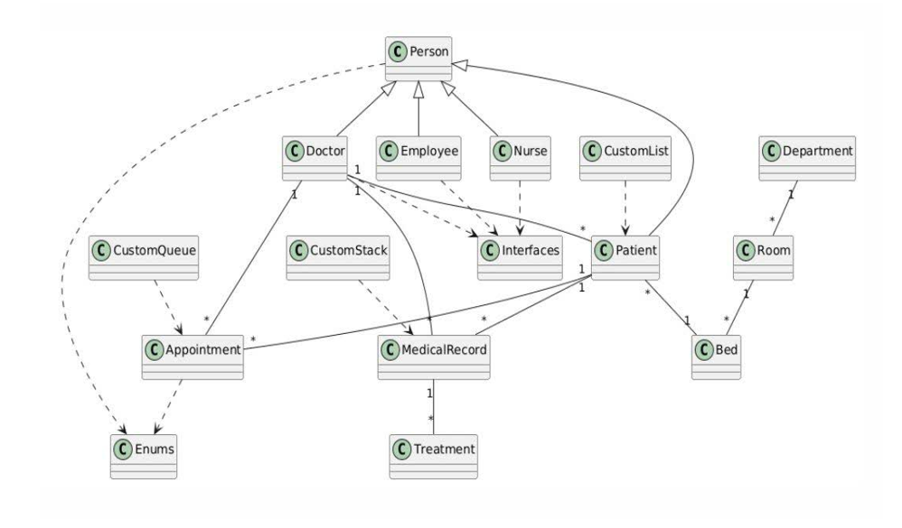
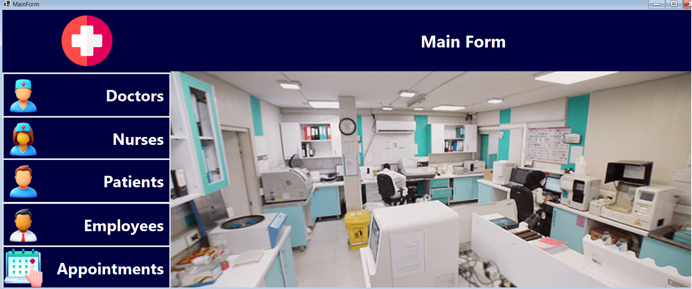

# Advanced Hospital Management System

An advanced, comprehensive desktop platform designed for hospital operation management, built with **C#** and **Windows Forms (.NET)**. This project demonstrates strict adherence to Object-Oriented Programming (OOP) principles, custom data structures, and a structured layered architecture.

---

## Project Overview

This system is a comprehensive platform for managing hospital operations, designed to strictly follow Object-Oriented Programming (OOP) principles, custom-built data structures, and centralized data management.

---

## Core Features

### 1. Advanced OOP Concepts
* **4-Level Inheritance Tree:** `IIdentifiable` / `IPrintable` -> `Person` (Abstract) -> `Employee` (Abstract) -> `Doctor` / `Nurse`
* **Abstraction:** Defining base abstract classes like `Person` and `Employee`.
* **Interfaces:** Utilizing standard and custom interfaces (`IIdentifiable`, `IPrintable`, `IComparable`, `IEnumerable`).
* **Polymorphism:** Implementation of Method Overloading, Method Overriding, and dynamic behavior across derived classes.
* **Encapsulation:** Making all fields private and controlling access via properties.
* **Indexers & Operator Overloading:** Custom indexers implemented in `Hospital` and `Department` classes.

### 2. Custom Generic Collections
Built from scratch without relying on built-in standard collections:
* **`CustomList<T>`:** Dynamic generic list supporting traversal (`IEnumerable`) and bound checking.
* **`CustomQueue<T>`:** Generic FIFO queue for patient scheduling.
* **`CustomStack<T>`:** Generic LIFO stack for operation logs and action history.

### 3. Events, Delegates & Enums
* **Custom Events & Delegates:** Managing bed status changes, record logging, and patient alerts.
* **Variety of Enums:** Over 10 custom enums for roles, admission statuses, medical specialties, and shift schedules.

---

## Architecture & Project Structure

The project is implemented in two logical layers:
### Class Diagram (UML)



### 1. Domain & Core Logic Layer (`managment hospital`)
* **`CustomCollections/`**: Hand-crafted data structures (`CustomList`, `CustomQueue`, `CustomStack`).
* **`Interface/`**: Base domain interfaces.
* **`Models/`**:
  * **`Enum/`**: System state and role definitions.
  * **`Hospital/`**: Structural domain models (`Department`, `Room`, `Bed`).
  * **`Medical/`**: Clinical operation models (`MedicalRecord`, `Appointment`, `Treatment`).
  * **`People/`**: Hierarchy for staff and patients (`Person`, `Patient`, `Employee`, `Doctor`, `Nurse`).

### 2. User Interface Layer (`WinFormsApp1`)
* **`MainForm`**: Central system dashboard.
* **`PatientsForm`**: Patient records and intake management.
* **`DoctorsForm`**: Physician and specialty management.
* **`NursesForm`**: Nursing staff management.
* **`EmployeeForm`**: Administrative staff management.
* **`AppointmentsForm`**: Scheduling and appointment system.

---

## Tech Stack & Tools

* **Language:** C# (.NET)
* **UI Framework:** Windows Forms (WinForms)
* **IDE:** Visual Studio 2022
* **Version Control:** Git & GitHub

---

## Getting Started

1. **Clone the repository:**
   ```bash
   git clone [https://github.com/mohamad-hosein-iren/HospitalManagment.git](https://github.com/mohamad-hosein-iren/HospitalManagment.git)
## Screenshots


